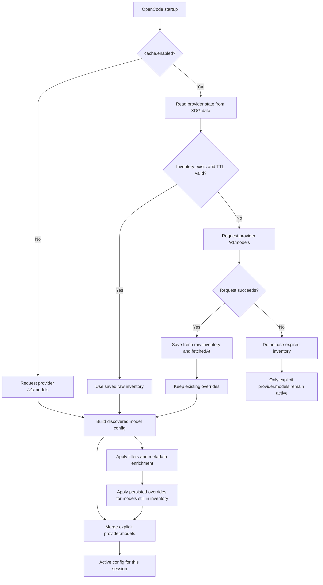
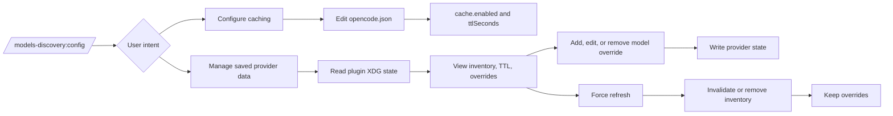

# Persisted Model Discovery PRD

## Summary

Add opt-in, provider-scoped caching for discovered OpenAI-compatible model configurations. The plugin will save a provider's filtered and metadata-enriched discovered model set in its own XDG data directory, reuse it until its TTL expires, and refresh it from the provider when it expires.

Users can manage provider-specific model overrides through the existing `/models-discovery:config` assistant-guided flow. Overrides are stored separately from cached discovery results, survive successful refreshes, and are applied only to models present in the current valid model set.

The feature must not write to `opencode.json`, OpenCode or Mimocode auth stores, or any managed host configuration.

## Goals

- Let local consumers, including GUI clients, read the latest successful model inventory from a stable provider-scoped file.
- Avoid unnecessary `/v1/models` requests while a persisted inventory remains within its TTL.
- Keep provider discovery fail-open: corrupt state and filesystem failures must not prevent normal live discovery.
- Keep user model customization separate from provider-provided raw data.
- Preserve the existing precedence of explicit `provider.<id>.models` configuration.
- Use `/models-discovery:config` as the only assistant-guided entry point for enabling caching and managing saved model overrides.

## Non-Goals

- Caching is not enabled by default.
- The plugin will not rewrite `opencode.json`, `opencode.jsonc`, or `.opencode/opencode.json` during discovery.
- The plugin will not persist API keys, authorization headers, `/connect` credentials, environment-derived secrets, or model-info endpoint responses.
- The plugin will not apply a global default capability template to all discovered models.
- The plugin will not use an expired inventory when live refresh fails.
- The plugin will not keep injecting a model that is absent from the latest valid provider inventory.

## User Configuration

Caching is configured per provider under `provider.<id>.options.modelsDiscovery.cache`.

```json
{
  "provider": {
    "local-vllm": {
      "npm": "@ai-sdk/openai-compatible",
      "options": {
        "baseURL": "http://127.0.0.1:8000/v1",
        "modelsDiscovery": {
          "enabled": true,
          "cache": {
            "enabled": true,
            "ttlSeconds": 86400
          }
        }
      }
    }
  }
}
```

| Option | Type | Default | Meaning |
| --- | --- | --- | --- |
| `cache.enabled` | `boolean` | `false` | Enables the provider discovery cache. |
| `cache.ttlSeconds` | non-negative finite number | `86400` | How long a successfully cached model set remains valid. |

When `cache.enabled` is omitted or `false`, discovery retains its current behavior: request the provider during startup and do not write a provider cache file.

## Provider State

### Location

The plugin stores state in its own XDG data directory:

```text
${XDG_DATA_HOME}/opencode-models-discovery/providers/provider-<encoded-provider-id>.json
```

The runtime derives the base directory with the existing `xdg-basedir` dependency. It uses that dependency's `xdgData` fallback when `XDG_DATA_HOME` is not set.

The encoded provider identifier must be safe as one path component. Raw provider IDs must never be joined directly into a filesystem path.

The plugin must not store state inside these host-owned locations:

```text
${xdgData}/opencode/auth.json
${xdgData}/mimocode/auth.json
```

### File Schema

State files use a versioned schema. A first successful discovery contains no `overrides` field.

```json
{
  "version": 1,
  "provider": {
    "id": "local-vllm",
    "baseURL": "http://127.0.0.1:8000",
    "endpoint": "/v1/models"
  },
  "fetchedAt": "2026-07-20T04:00:00.000Z",
  "inventory": [
    {
      "id": "Qwen/Qwen3-32B",
      "object": "model",
      "max_model_len": 32768
    }
  ]
}
```

When a user explicitly customizes a discovered model, the state gains an `overrides` object:

```json
{
  "version": 1,
  "provider": {
    "id": "local-vllm",
    "baseURL": "http://127.0.0.1:8000",
    "endpoint": "/v1/models"
  },
  "fetchedAt": "2026-07-20T04:00:00.000Z",
  "inventory": [
    {
      "id": "Qwen/Qwen3-32B",
      "object": "model",
      "max_model_len": 32768
    }
  ],
  "overrides": {
    "Qwen/Qwen3-32B": {
      "reasoning": true,
      "variants": {
        "high": {
          "reasoningEffort": "high"
        }
      }
    }
  }
}
```

Rules:

- `inventory` contains only valid raw provider model entries with a non-empty string `id`.
- `provider.baseURL` is normalized before storage.
- The state identity includes provider ID, normalized base URL, and models endpoint.
- A state file with a different identity or unknown version is a cache miss.
- `overrides` is absent unless it contains at least one model override.
- Removing the final override removes the `overrides` field.
- Overrides cannot change a discovered model's `id`.
- No credential or secret fields are stored.

## Discovery Behavior



### Fresh Inventory

When caching is enabled and the saved state identity matches the current provider configuration:

- If `fetchedAt + ttlSeconds` is in the future, use `inventory` without requesting `/v1/models`.
- The plugin does not need to resolve credentials when it uses a fresh persisted inventory.
- Existing field filters, regex filters, model categorization, smart naming, and metadata enrichment still run against the raw saved entries.

### Missing Or Expired Inventory

When caching is enabled but state is missing, invalid, identity-mismatched, or expired:

- Do not use the previous inventory for runtime injection.
- Resolve credentials using the existing precedence rules.
- Request the configured provider models endpoint.
- On a successful response, validate raw model entries and atomically replace the persisted inventory and `fetchedAt` value.
- Preserve any existing `overrides` for the same provider identity.
- A successful empty response is authoritative and is persisted as an empty inventory.

### Failed Refresh

When a missing or expired inventory cannot be refreshed:

- Do not inject models from the expired inventory.
- Do not delete the provider state or its overrides.
- Preserve only explicit `provider.<id>.models` entries in the active config.
- Log the discovery failure using the existing provider, base URL, and endpoint context.

This intentionally favors correctness over offline availability. An expired model list may no longer represent models the provider accepts.

## Override Behavior

Overrides are user-owned model configuration fragments. They are separate from raw inventory so that the provider remains authoritative for model existence while users retain their chosen configuration.

Generated configuration precedence is:

```text
live or valid persisted raw inventory
  < persisted per-model overrides
  < explicit provider.<id>.models in opencode.json
```

Override merge rules:

- Merge plain objects recursively.
- Replace arrays as complete values.
- Do not permit an override to replace the model ID.
- Apply an override only if the corresponding model is present in the current valid inventory.
- Apply the explicit OpenCode model configuration last, as it already has the highest priority.

Override lifecycle:

| Situation | Result |
| --- | --- |
| Inventory remains within TTL | Apply the override normally. |
| TTL expires and refresh succeeds with the same model | Preserve and apply the override to the new raw model data. |
| TTL expires and refresh succeeds without the model | Keep the override in state but do not inject the model. The override is inactive. |
| The model appears in a later valid inventory | Automatically apply the inactive override again. |
| TTL expires and refresh fails | Keep the override in state but do not inject the model. |
| User removes an override | Delete it permanently; do not recreate it during later refreshes. |

## Config Command

Do not add a new command. Extend the existing `/models-discovery:config` assistant-guided flow.



The command template must direct the assistant to:

- Edit `provider.<id>.options.modelsDiscovery.cache` only when the user requests caching.
- Explain that persisted state is plugin-owned data, not a replacement for `opencode.json`.
- Locate and inspect only the selected provider's plugin state file when the user asks to manage saved data.
- Show inventory, last successful fetch time, TTL validity, and existing overrides before editing state.
- Require confirmation before removing an override or invalidating/removing an inventory.
- Preserve overrides when a user requests a force refresh.
- Never edit OpenCode or Mimocode auth stores, API keys, or managed configuration while managing persisted state.
- Explain that an override for a missing provider model remains inactive until the provider returns that model again.

## Implementation Plan

### Configuration And Validation

- Extend `ProviderDiscoveryConfig` in `src/types/plugin-config.ts` with a `cache` object.
- Define `DEFAULT_CACHE_TTL_SECONDS = 86400`.
- Validate `cache.enabled` as a boolean when present.
- Validate `cache.ttlSeconds` as a finite number greater than or equal to zero.
- Document the new options in `docs/configuration.md` and the README.

### Provider Model Store

Add `src/plugin/provider-model-store.ts` with a focused cache boundary.

The module must:

- Derive a plugin-owned XDG data location.
- Build safe provider file paths.
- Read and validate versioned state.
- Determine TTL freshness.
- Check provider ID, normalized base URL, and endpoint identity.
- Preserve valid overrides when replacing an inventory for the same identity.
- Write atomically using a same-directory temporary file and `rename`.
- Treat missing, corrupt, unreadable, and unwritable state as non-fatal.
- Use restrictive file permissions where supported.

The store should be injectable or receive an optional root directory so tests do not write to a developer's real XDG data location.

### Discovery Integration

Update `src/plugin/enhance-config.ts` to:

- Read fresh persisted raw inventory before resolving credentials or making a provider request.
- Refresh only when inventory is absent or expired.
- Never use stale inventory after TTL expiration.
- Persist successful live results before building the active model configuration.
- Run filters and enrichers after either a cache read or a live response.
- Apply persisted overrides before merging explicit `p.models` entries.
- Use the existing `isValidModel()` guard before storing or injecting raw entries.

Track plugin-injected models across repeated calls against the same config object with a module-local `WeakMap`. This lets a later successful refresh remove only prior discovered models that no longer exist, while preserving user-defined models that share the provider configuration.

### Command And Documentation

- Extend `CONFIG_COMMAND_TEMPLATE` in `src/plugin/commands.ts` with cache setup and state management guidance.
- Do not add a command name or a direct TypeScript command handler.
- Update README feature and helper-command sections.
- Add a dedicated cache section to `docs/configuration.md`.

## Error Handling And Security

- Disk cache writes are best-effort and must not make plugin startup fail.
- A state parsing or schema error is a cache miss, not a user-facing configuration error.
- A write error after a successful live response must not discard the live discovery result for the current session.
- The plugin must never serialize API keys, resolved keys, authorization headers, auth file contents, or environment credentials.
- Provider IDs must not permit directory traversal or arbitrary file access.
- State management through `/models-discovery:config` must require user confirmation before destructive actions.

## Acceptance Criteria

- Caching is disabled by default and produces no cache file.
- A provider with caching enabled writes a versioned, credential-free model cache after a successful discovery.
- A valid inventory within its TTL is used without calling the models endpoint.
- An expired inventory is never injected when the live refresh fails.
- A successful refresh replaces raw inventory while retaining existing overrides for the same source identity.
- A changed provider ID, normalized base URL, or models endpoint invalidates old persisted inventory.
- Explicit `provider.<id>.models` configuration overrides both discovered data and persisted overrides.
- Overrides are absent until a user creates one and removed when the final override is deleted.
- Overrides for models missing from the current inventory remain stored but inactive.
- Repeated config enhancement can remove prior discovered-only models that disappear from an authoritative refreshed inventory without removing user models.
- `/models-discovery:config` supports both enabling caching and managing provider state without adding a second command.

## Test Plan

Add focused tests for the provider model store and integration tests for the config hook.

| Area | Required coverage |
| --- | --- |
| Configuration | Default disabled behavior, default 24-hour TTL, invalid TTL validation. |
| Store paths | Safe provider ID encoding and XDG-root derivation. |
| Store reads | Missing files, corrupt JSON, unsupported version, invalid schema, and identity mismatch. |
| TTL | Fresh state is used, expired state requires live discovery, zero TTL expires immediately. |
| Writes | Atomic write success, write failure remains non-fatal, secret fields are absent. |
| Discovery | Fresh inventory skips network and credential resolution; successful live refresh persists raw models. |
| Failed refresh | Expired inventory is not injected and explicit models remain active. |
| Overrides | Deep object merge, array replacement, model ID protection, inactive missing-model behavior, and restoration when the model returns. |
| Precedence | Raw inventory, persisted override, and explicit `provider.<id>.models` precedence. |
| Repeated hooks | Refresh removes stale discovered-only models while preserving explicit user models. |
| Commands | `/models-discovery:config` documents setup, state inspection, confirmation, force refresh, and security boundaries. |
